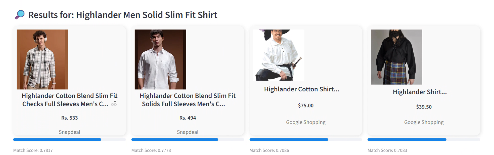
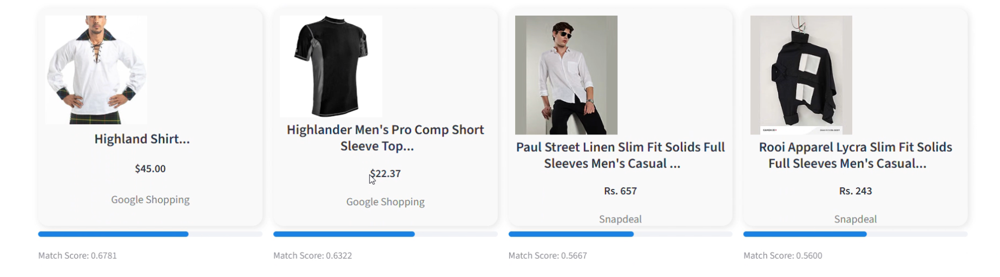

# 🛡️ AI Product Sentinel

AI Product Sentinel is a smart product comparison tool that helps you find similar products across different marketplaces using AI. Instead of relying on simple keyword matching, it understands the meaning of a product and suggests the most relevant alternatives.

This project is designed to simulate how modern recommendation systems work using vector embeddings and semantic similarity.

---

## 🚀 What this project does

You just need to paste any product URL and the application will automatically:

* Extract the product name from the URL
* Search for similar products online
* Compare them using AI
* Display the best matches with a similarity score

---

## 📸 Screenshots

### 🔹 Before Running Analysis

This is the initial interface where the user inputs the product URL.

 
### 🔹 After Running Analysis

After clicking **Run Analysis**, the system displays the top 8 most similar products along with similarity scores.


  
---
## 🧠 How it works

The workflow is simple and efficient:

1. User enters a product URL
2. The product name is extracted
3. The system fetches products from:

   * Snapdeal
   * Google Shopping
4. Each product title is converted into a vector using a transformer model
5. Using the Endee.io vector database, similarity is computed
6. Products are ranked based on similarity
7. Top 8 most relevant products are displayed in the UI

---

## ✨ Features

* Accepts any product URL
* Compares products across multiple platforms
* Uses AI for semantic understanding
* Provides real-time results
* Displays similarity score (match confidence)
* Shows top 8 best matches
* Clean and interactive Streamlit interface

---

## 🏗️ Tech Stack

* Frontend: Streamlit
* Backend: Python
* Web Scraping: BeautifulSoup, Requests
* AI Model: Sentence Transformers (all-MiniLM-L6-v2)
* Vector Database: Endee.io
* External API: SerpAPI (Google Shopping)

---

## 💡 Why Endee.io?

Traditional systems rely on keyword matching, which often gives poor results.

In this project, Endee.io vector database is used to:

* Understand the meaning of product names
* Match products even if wording is different
* Enable fast and accurate similarity search

This makes the system smarter and closer to real-world AI recommendation engines.

---

## 📦 Setup Instructions

Clone the repository:
<<<<<<< HEAD
git clone https://github.com/your-username/AI-Product-Sentinel.git
cd AI-Product-Sentinel
=======

```
git clone https://github.com/your-username/ai-product-sentinel.git  
cd ai-product-sentinel  
```
>>>>>>> ee46b8f (Added README with screenshots)

Install dependencies:

```
pip install streamlit requests beautifulsoup4 sentence-transformers google-search-results  
```

Make sure Endee.io is running locally at:

```
http://localhost:8080/api/v1  
```

Add your SerpAPI key in the code:

```
SERP_API_KEY = "YOUR_SERPAPI_KEY"  
```

---

## ▶️ Run the application

```
streamlit run app.py  
```

---

## 🧪 Example Usage

Paste any product link (like shoes, electronics, etc.), click **Run Analysis**, and the app will display the top 8 most similar products along with their match scores.

---

## 🔮 Future Improvements

* Add Amazon and Flipkart integration
* Highlight best deal (lowest price)
* Add direct purchase links
* Improve UI design further
* Deploy the application online

---
## 🎥 Demo

Watch the demo video below:

[Click to watch demo](Demovideo/Demo.mp4)

## 👩‍💻 Author

Ramya

---

## ⭐ Final Note

This project demonstrates how AI combined with vector databases like Endee.io can be used to build intelligent and scalable product recommendation systems.
